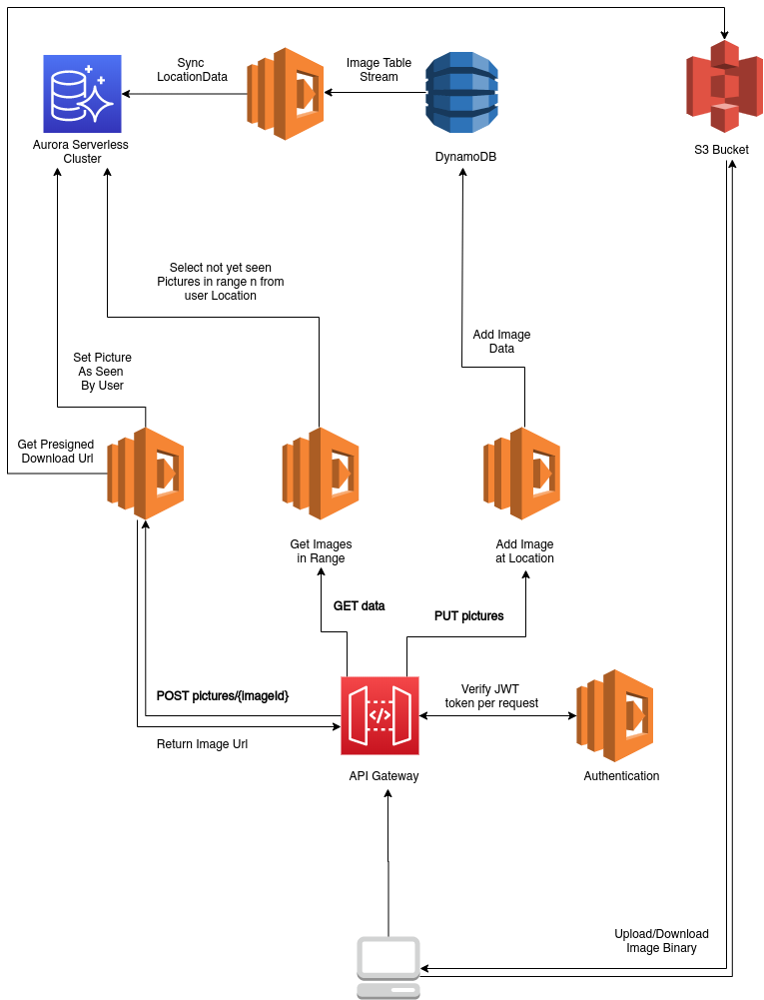

# location-snap

Project Integrating Location based picture posting and Viewing.

# Contents:

- [About](#about)
- [Demo](#demo)
- [Setup](#setup)

# About

This Project was build as part of Udacitys Cloud Developer Nanodegree graduation project. The scope of the project was to be set by the developer and there were no limitations as to what kind of stacks to use.

## Application Scope

Location Snap is a location based public image posting application. Users can signup and login via [Auth0](https://auth0.com/) and then proceed to post images.

Each image posted is maped to a physical location in the world(geolocation). Authenticated Users can query for all images in a radius to a geolocation, which both are provided as query parameters.

A list of imageId's and the distance of each image to the user (in km, rounded as integer) will be returned.

With that data, the user can proceed to open a single image. The userId will be added to the list of users who have viewed the image and a presigned url to access the image will be returned to the user, future queries for pictures won't return the one which has just been accessed.

## Application Stack

The whole application has been developed using the serverless framework, AWS and Auth0 as Identity provider:



While the whole application could have been developed using a single database, it has been split into using DynamoDB for image metadata and Postgres to process location related data:

Postgres is hosted on an AWS RDS Aurora Serverless cluster, thus making the whole application completly 'serverless' without even the need to provision instances.

With the underlying R-Tree structure, Postgres with the PostGIS extension is very efficient at processing location distance queries (implementation chosen is EPSG 4326 with Cartesian plane instead of gegraphical sphere, which results in cheaper computational costs butsome precision loss on longer distances).

Choosing this implementation, location-based queries are faster and also much cheaper than with DynamoDB, while at the same time implementing DynamoDB offers easy and efficient future implementation of additional features (for example, adding user interaction such as liking / commenting on pictures).

# Demo

A due to data regulations private Demo of the running application can be found [here](https://d2ovsmn4ut11iq.cloudfront.net/). Please contact me for the password.

# Setup

```
git clone https://github.com/willsamu/location-snap.git
```

## Backend

**NOTE:** Deploying this configuration will create resources on AWS for which you will be charged according to AWS's pricing conditions.

Signup at [Auth0](https://auth0.com/) and create an application with RS256 encrypted signature.

Replace jwksUrl in `src/lambda/auth/auth0Authorizer.ts` with your Auth0JSON Web Key Set.

Install and setup [Serverless for usage with AWS](https://www.serverless.com/framework/docs/providers/aws/guide/credentials/).

```
cd backend && yarn
```

Open serverless.yml and Comment/Remove Entity `RDSCluser` (line 222 - 236).

```
sls deploy
```

This deploys the Cloudformation stack to AWS, not including the Aurora Cluster. Alternatively run `sls deploy --stage {desiredStageName}` to select a different stage.

Open AWS Console -> Secrets Manager, select `snap-rds-key-{stage}`, and insert a username & password for the Cluster:

```json
{
  "username": "myUsername",
  "password": "mySecurePassword"
}
```

Uncomment/Add the `RDSCluster` again.

Finally and for further deploys, run `sls deploy` again.

## Frontend

```
cd frontend && yarn
```

Edit the `config.ts` file with the apiId provided from Api Gateway, and the region you've used for deployment (default `eu-central-1`).

Populate `authConfig.domain` and `authConfig.clienId` with your Auth0 App resources.

Add the url `{hostingUrl}/callback` as valid callback url in the Auth0 Console.

Optionally set another `reactPassword` which blocks the page content from public access.

```
yarn start
```
